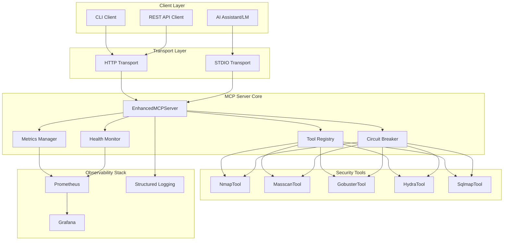
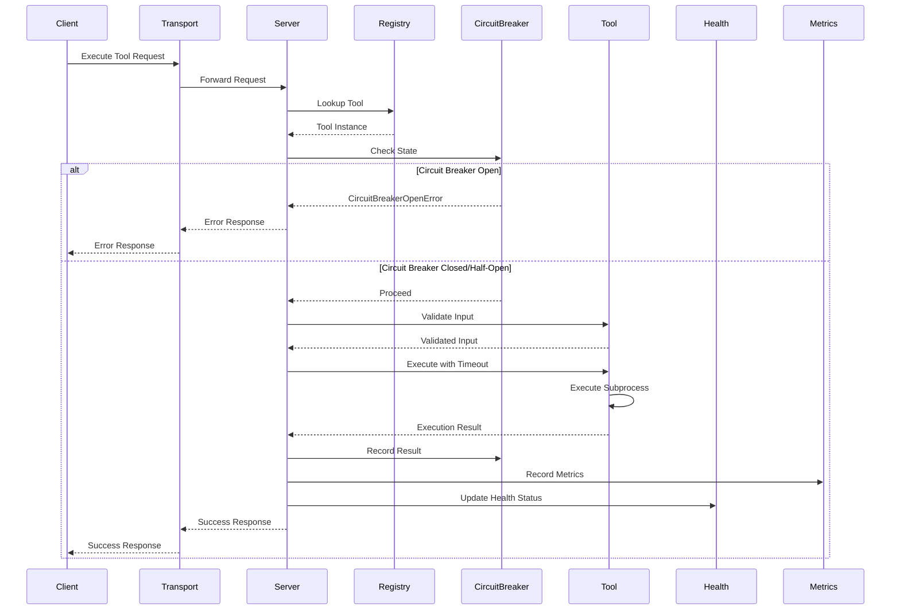
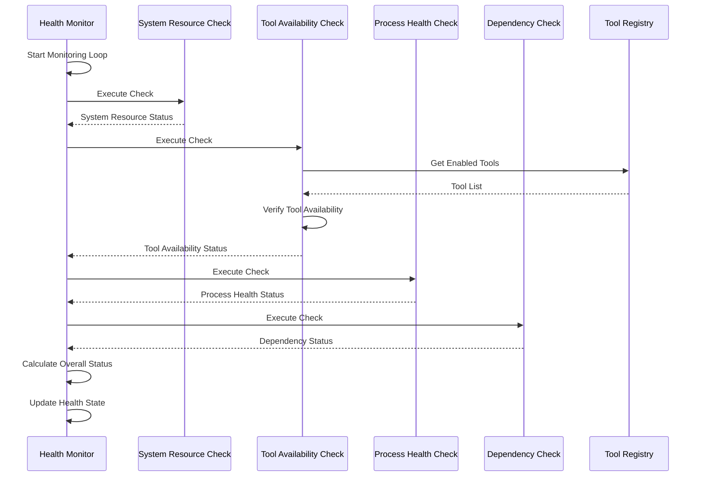
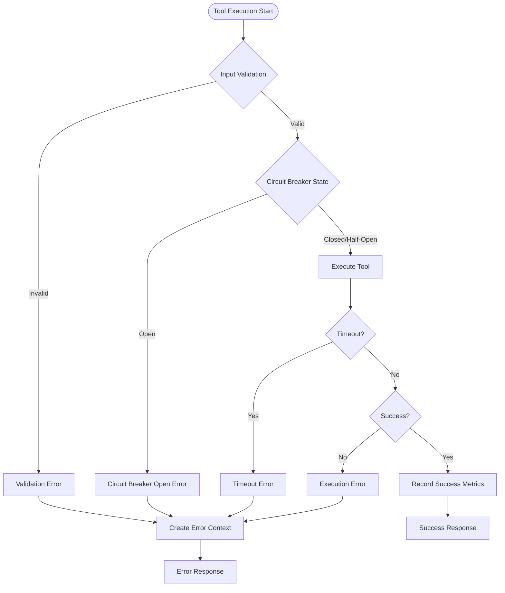
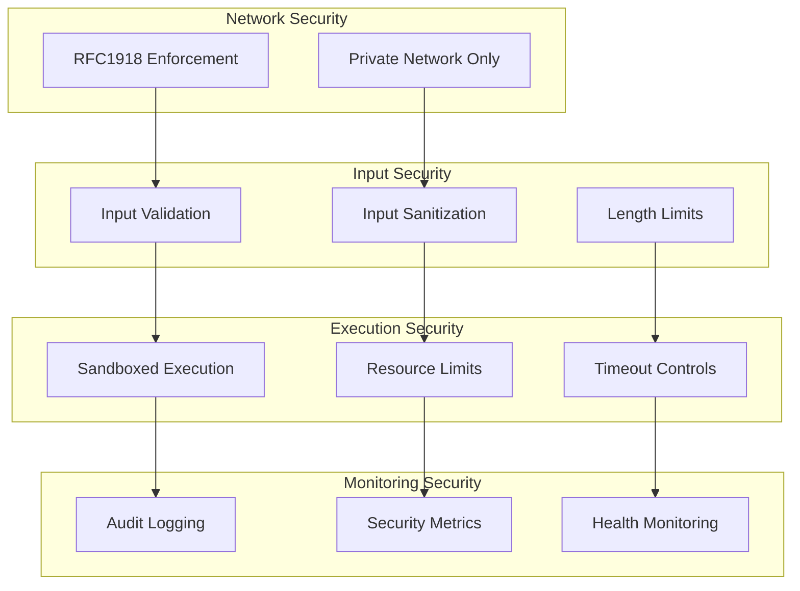
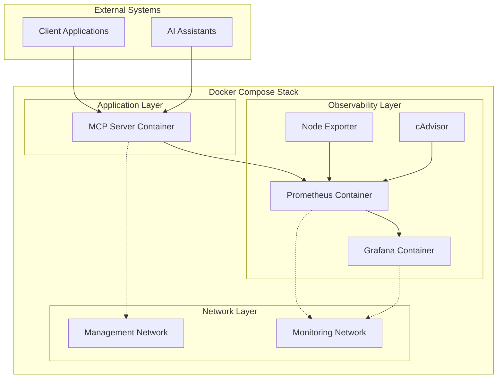

# Security MCP Server - Project Architecture Document

## Table of Contents
1. [Executive Summary](#executive-summary)
2. [Architecture Overview](#architecture-overview)
3. [Component Deep Dive](#component-deep-dive)
4. [Codebase Catalog](#codebase-catalog)
5. [Application Logic Flow](#application-logic-flow)
6. [Security Architecture](#security-architecture)
7. [Deployment Architecture](#deployment-architecture)
8. [Development Guidelines](#development-guidelines)
9. [Contributing Guidelines](#contributing-guidelines)
10. [Troubleshooting Guide](#troubleshooting-guide)

---

## Executive Summary

The Security MCP Server is an enterprise-grade security tool orchestration platform that provides a unified, production-ready framework for secure execution of security tools with comprehensive reliability, monitoring, and safety features. The system implements the Model Context Protocol (MCP) to enable seamless integration with AI coding assistants while maintaining strict security controls and enterprise-grade resilience patterns.

### Key Objectives
- **Unified Security Tool Orchestration**: Single interface for multiple security tools
- **Enterprise-Grade Reliability**: Circuit breakers, health monitoring, and graceful degradation
- **Comprehensive Security**: RFC1918 enforcement, input validation, and sandboxed execution
- **Full Observability**: Prometheus metrics, Grafana dashboards, and structured logging
- **AI Assistant Integration**: Native MCP support for LLM tool calling

---

## Architecture Overview

### High-Level System Architecture



### Architectural Principles

1. **Defense in Depth**: Multiple layers of security controls
2. **Fail-Safe Operation**: Graceful degradation when components fail
3. **Observable by Design**: Comprehensive monitoring and logging
4. **Async-First**: Non-blocking operations throughout the stack
5. **Configuration-Driven**: Flexible behavior through configuration

---

## Component Deep Dive

### Transport Layer

The transport layer provides dual protocol support for different use cases:

- **HTTP Transport**: FastAPI-based REST API for service integration
- **STDIO Transport**: Native MCP protocol for AI assistant integration

Both transports implement the same core functionality with protocol-specific optimizations.

### Server Core

The `EnhancedMCPServer` is the central orchestrator that:
- Manages transport lifecycle
- Coordinates tool execution
- Handles health monitoring
- Collects and exposes metrics
- Implements graceful shutdown

### Tool Registry

The `ToolRegistry` provides:
- Dynamic tool discovery and registration
- Enable/disable functionality
- Tool metadata management
- Configuration-based filtering

### Circuit Breaker

The `CircuitBreaker` implements:
- Failure detection and isolation
- Adaptive recovery timeouts
- State management (CLOSED, OPEN, HALF_OPEN)
- Prometheus metrics integration

### Health Monitor

The `HealthCheckManager` provides:
- Priority-based health checks
- System resource monitoring
- Tool availability verification
- Dependency health checking

### Metrics Manager

The `MetricsManager` handles:
- Tool execution metrics
- System-wide statistics
- Prometheus integration
- Memory-efficient storage

---

## Codebase Catalog

### Core Infrastructure Files

#### `server.py`
**Purpose**: Main server implementation and orchestration
**Key Classes**:
- `EnhancedMCPServer`: Central server orchestrator
- `ToolRegistry`: Tool management and discovery
**Responsibilities**:
- Transport management (HTTP/stdio)
- Tool registration and lifecycle
- Health monitoring coordination
- Metrics collection integration
- Graceful shutdown handling

#### `base_tool.py`
**Purpose**: Base class for all security tools with enterprise features
**Key Classes**:
- `MCPBaseTool`: Abstract base for all tools
- `ToolInput`: Input validation model
- `ToolOutput`: Output formatting model
**Responsibilities**:
- Common tool functionality
- Input validation and sanitization
- Resource limit enforcement
- Subprocess management
- Error handling and context

#### `config.py`
**Purpose**: Configuration management with validation and hot-reload
**Key Classes**:
- `MCPConfig`: Main configuration class
- `SecurityConfig`: Security-specific configuration
- `ServerConfig`: Server configuration
**Responsibilities**:
- Layered configuration (defaults → file → environment)
- Configuration validation
- Hot-reload capability
- Sensitive data redaction

### Resilience and Monitoring Files

#### `circuit_breaker.py`
**Purpose**: Circuit breaker implementation for resilience
**Key Classes**:
- `CircuitBreaker`: Main circuit breaker implementation
- `CircuitBreakerState`: State enumeration
- `CircuitBreakerStats`: Statistics tracking
**Responsibilities**:
- Failure detection and isolation
- Adaptive recovery timeouts
- State management and transitions
- Prometheus metrics integration

#### `health.py`
**Purpose**: Health monitoring system with priority-based checks
**Key Classes**:
- `HealthCheckManager`: Health check orchestration
- `SystemResourceHealthCheck`: System resource monitoring
- `ToolAvailabilityHealthCheck`: Tool availability verification
**Responsibilities**:
- Health check execution and coordination
- Priority-based status calculation
- System resource monitoring
- Dependency health verification

#### `metrics.py`
**Purpose**: Metrics collection and Prometheus integration
**Key Classes**:
- `MetricsManager`: Metrics orchestration
- `ToolMetrics`: Per-tool metrics collection
- `SystemMetrics`: System-wide metrics
**Responsibilities**:
- Tool execution metrics
- Prometheus integration
- Memory-efficient storage
- Percentile calculations

### Security Tool Implementation Files

#### `nmap_tool.py`
**Purpose**: Network discovery and port scanning tool
**Key Features**:
- Network range validation and limits
- Script category filtering with policy enforcement
- Performance optimizations with safe defaults
- Port specification safety
**Security Controls**:
- RFC1918 target enforcement
- Script policy enforcement
- Network size limits
- Flag allowlisting

#### `masscan_tool.py`
**Purpose**: High-speed port scanning with rate limiting
**Key Features**:
- Rate limiting enforcement
- Large network range support
- Interface validation
- Banner grabbing control
**Security Controls**:
- Configurable rate limits
- Network size validation
- Private network enforcement
- Banner grabbing policy

#### `gobuster_tool.py`
**Purpose**: Content and DNS discovery with mode-specific validation
**Key Features**:
- Mode-specific validation (dir/dns/vhost)
- Wordlist size validation
- Thread count optimization
- URL validation
**Security Controls**:
- Private network enforcement
- Wordlist path validation
- Thread count limits
- Extension filtering

#### `hydra_tool.py`
**Purpose**: Authentication testing with payload sanitization
**Key Features**:
- Service-specific validation
- Password list size restrictions
- Form payload handling
- Thread count limitations
**Security Controls**:
- Private network enforcement
- Payload token sanitization
- Password file validation
- Thread count limits

#### `sqlmap_tool.py`
**Purpose**: SQL injection detection with risk clamping
**Key Features**:
- URL validation with authorization checks
- Risk and test level restrictions
- Payload token handling
- Batch mode enforcement
**Security Controls**:
- URL target validation
- Risk level clamping
- Test level restrictions
- Batch mode enforcement

---

## Application Logic Flow

### Tool Execution Flow



### Health Check Flow



### Error Handling Flow



---

## Security Architecture

### Defense in Depth Model



### Security Controls Implementation

1. **Network Isolation**
   - RFC1918 IP address enforcement
   - .lab.internal hostname validation
   - CIDR range size limits

2. **Input Validation**
   - Regex-based metacharacter filtering
   - Argument length limits
   - Flag allowlisting

3. **Execution Controls**
   - Subprocess resource limits
   - Execution timeouts
   - Process group isolation

4. **Monitoring & Auditing**
   - Complete execution audit trail
   - Security event logging
   - Metrics for security monitoring

---

## Deployment Architecture

### Container-Based Deployment



### Deployment Components

1. **MCP Server Container**
   - Multi-stage build with security tools
   - Non-root user execution
   - Health check endpoint
   - Graceful shutdown handling

2. **Observability Stack**
   - Prometheus for metrics collection
   - Grafana for visualization
   - Node Exporter for system metrics
   - cAdvisor for container metrics

3. **Network Configuration**
   - Segregated networks for management and monitoring
   - Port exposure control
   - Inter-container communication

---

## Development Guidelines

### Coding Standards

1. **Python Standards**
   - Follow PEP 8 style guidelines
   - Use type hints for all function signatures
   - Implement comprehensive docstrings
   - Use async/await for I/O operations

2. **Error Handling**
   - Use specific exception types
   - Provide context with error messages
   - Implement proper logging
   - Include recovery suggestions

3. **Security Practices**
   - Validate all inputs
   - Use allowlists over blocklists
   - Implement principle of least privilege
   - Sanitize all outputs

### Testing Guidelines

1. **Unit Testing**
   - Test all public methods
   - Mock external dependencies
   - Test error conditions
   - Achieve >80% code coverage

2. **Integration Testing**
   - Test tool execution end-to-end
   - Verify API responses
   - Test circuit breaker behavior
   - Validate health checks

3. **Performance Testing**
   - Benchmark tool execution
   - Test concurrent operations
   - Validate resource limits
   - Monitor memory usage

---

## Contributing Guidelines

### Development Workflow

1. **Setup Development Environment**
   ```bash
   git clone https://github.com/nordeim/Security-MCP-Server.git
   cd Security-MCP-Server
   python -m venv venv
   source venv/bin/activate
   pip install -r requirements-dev.txt
   pre-commit install
   ```

2. **Create Feature Branch**
   ```bash
   git checkout -b feature/amazing-feature
   ```

3. **Make Changes**
   - Follow coding standards
   - Add tests for new functionality
   - Update documentation
   - Ensure all tests pass

4. **Submit Pull Request**
   - Provide clear description
   - Link to relevant issues
   - Request code review
   - Address feedback

### Code Review Process

1. **Automated Checks**
   - Code style validation
   - Test suite execution
   - Security scanning
   - Documentation build

2. **Manual Review**
   - Architecture compliance
   - Security review
   - Performance impact
   - Documentation accuracy

---

## Troubleshooting Guide

### Common Issues and Solutions

#### Tool Execution Failures

**Symptoms**: Tools return error codes or timeout
**Causes**: 
- Tool not installed or not in PATH
- Insufficient permissions
- Resource limits exceeded
- Network connectivity issues

**Solutions**:
```bash
# Check tool availability
which nmap
which masscan

# Verify permissions
ls -la /usr/bin/nmap

# Check resource limits
ulimit -a

# Test network connectivity
ping 192.168.1.1
```

#### Circuit Breaker Issues

**Symptoms**: Requests rejected with "Circuit breaker open" errors
**Causes**:
- Repeated tool failures
- Network connectivity issues
- Resource exhaustion

**Solutions**:
```bash
# Check circuit breaker status
curl http://localhost:8080/health

# Force reset circuit breaker
curl -X POST http://localhost:8080/tools/NmapTool/reset

# Monitor metrics
curl http://localhost:8080/metrics
```

#### Health Check Failures

**Symptoms**: Health endpoint returns degraded or unhealthy status
**Causes**:
- High resource utilization
- Tool availability issues
- Dependency failures

**Solutions**:
```bash
# Check detailed health status
curl http://localhost:8080/health | jq .

# Monitor system resources
docker stats

# Check tool availability
docker exec mcp-server which nmap
```

#### Performance Issues

**Symptoms**: Slow response times or timeouts
**Causes**:
- High system load
- Insufficient resources
- Network latency

**Solutions**:
```bash
# Monitor performance
curl http://localhost:8080/metrics | grep mcp_tool_execution_seconds

# Check resource usage
docker stats mcp-server

# Optimize configuration
export MCP_DEFAULT_CONCURRENCY=4
export MCP_DEFAULT_TIMEOUT_SEC=600
```

### Debug Mode

Enable debug logging for detailed troubleshooting:
```bash
export LOG_LEVEL=DEBUG
python -m mcp_server.server
```

### Log Analysis

Common log patterns to monitor:
- `tool.error`: Tool execution failures
- `circuit_breaker.open`: Circuit breaker activations
- `health_check.failed`: Health check failures
- `metrics.record_failed`: Metrics collection issues

---

This Project Architecture Document provides a comprehensive overview of the Security MCP Server architecture, components, and operational guidelines. The document serves as the definitive source of truth for developers and contributors, ensuring consistent understanding and implementation of the system architecture.

For questions or contributions to this document, please refer to the Contributing Guidelines section or open an issue in the project repository.

https://chat.z.ai/s/11087f13-7577-4999-b364-6bf44990c409
