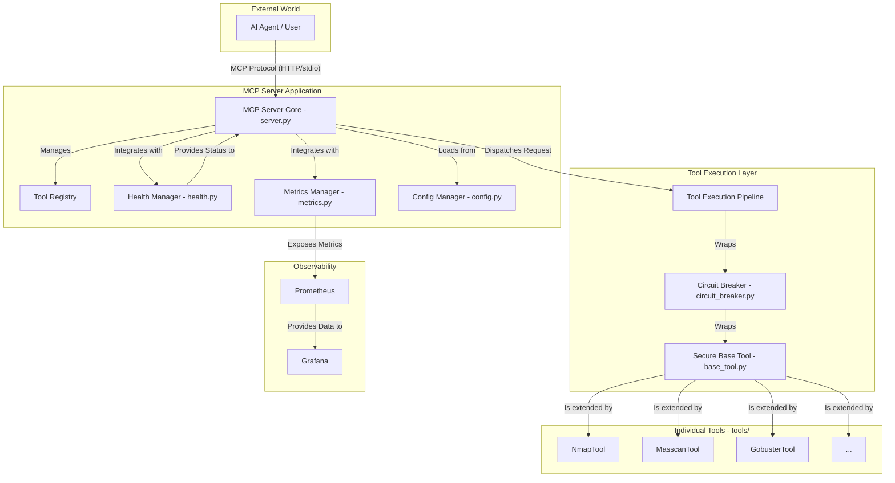

# Project Architecture Document (PAD)

## 1. Introduction

This document provides a comprehensive architectural overview of the Security Model Context Protocol (MCP) Server. It is intended to be the single source of truth for developers, providing a deep dive into the system's components, logic flows, and core concepts. The primary purpose of this project is to provide a secure, monitored, and resilient intermediary between AI agents and powerful command-line network security tools, preventing misuse and ensuring safe operation.

## 2. System Architecture

The application is designed with a modular, service-oriented architecture. Each component is responsible for a specific aspect of the system's functionality, promoting separation of concerns and maintainability.



## 3. File Hierarchy & Key Components

### File Hierarchy

```
.
├── Dockerfile
├── docker-compose.yml
├── mcp.json
├── mcp_client.py
├── config/
│   └── prometheus.yml
├── docker/
│   ├── alerts.yml
│   ├── entrypoint.sh
│   └── healthcheck.sh
├── mcp_server/
│   ├── server.py
│   ├── base_tool.py
│   ├── circuit_breaker.py
│   ├── config.py
│   ├── health.py
│   ├── metrics.py
│   └── tools/
│       ├── nmap_tool.py
│       ├── masscan_tool.py
│       ├── gobuster_tool.py
│       ├── hydra_tool.py
│       └── sqlmap_tool.py
├── scripts/
│   └── mcp_server_launcher.sh
└── tests/
    ├── conftest.py
    ├── test_nmap_tool.py
    └── ...
```

### Key Component Descriptions

| File / Module                  | Responsibility                                                                                                                                                                                                                         |
| ------------------------------ | -------------------------------------------------------------------------------------------------------------------------------------------------------------------------------------------------------------------------------------- |
| **`mcp_server/server.py`**     | The application's core. It initializes the server, discovers and registers tools, handles incoming requests (for both HTTP and stdio transports), and integrates with the health and metrics managers.                               |
| **`mcp_server/base_tool.py`**  | The security foundation. This abstract base class is inherited by all tools. It enforces the entire security model, including input validation, command sanitization, resource limits, concurrency control, and secure subprocess execution. |
| **`mcp_server/tools/`**        | The extensible tool directory. Each file defines a specific tool (e.g., `NmapTool`) by subclassing `MCPBaseTool` and defining a whitelist of allowed flags and tool-specific validation logic.                               |
| **`mcp_server/config.py`**     | A robust, multi-source configuration manager. It loads settings from defaults, YAML files, and environment variables, performs validation and sanitization, and supports hot-reloading.                                               |
| **`mcp_server/health.py`**     | The health monitoring engine. It runs periodic, priority-based health checks (e.g., for system resources, tool availability) and aggregates them into an overall system status (`HEALTHY`, `DEGRADED`, `UNHEALTHY`).                 |
| **`mcp_server/metrics.py`**    | The observability and metrics collection system. It tracks detailed statistics for each tool (latency, success rates) and exposes them in a Prometheus-compatible format.                                                              |
| **`mcp_server/circuit_breaker.py`** | A resilience component that wraps tool executions. It monitors for repeated failures and "opens the circuit" to prevent a failing tool from impacting the entire system, enabling graceful degradation.                               |
| **`Dockerfile`**               | A multi-stage Dockerfile that builds a minimal, secure, non-root container image for the application, including all necessary system dependencies (like `nmap`).                                                                       |
| **`docker-compose.yml`**       | Defines a full, production-like environment with the MCP server and a complete observability stack (Prometheus, Grafana, etc.), enabling comprehensive monitoring out-of-the-box.                                                      |

## 4. Execution Flow Diagrams

### User Interaction Flow (Sequence Diagram)

This diagram shows the sequence of events for a typical tool execution request from an AI agent.

```mermaid
sequenceDiagram
    participant Agent as AI Agent
    participant Server as MCP Server Core
    participant Registry as Tool Registry
    participant Breaker as Circuit Breaker
    participant Tool as Specific Tool (e.g., NmapTool)

    Agent->>+Server: Execute Tool Request (tool_name, target, args)
    Server->>Registry: Get Tool(tool_name)
    Registry-->>-Server: Return Tool Instance
    Server->>+Breaker: call(tool.run, ... )
    Breaker->>Breaker: Check State (e.g., CLOSED)
    Breaker->>+Tool: run(ToolInput)
    Tool->>Tool: Validate Input & Sanitize Args
    Tool->>Tool: Execute Hardened Subprocess
    Tool-->>-Breaker: Return ToolOutput
    Breaker->>Breaker: Record Success/Failure
    Breaker-->>-Server: Return Result
    Server-->>Agent: Formatted Response
```

### Application Logic Flow (Flowchart)

This diagram details the internal logic of the `MCPBaseTool.run()` method, which is the heart of the security and execution model.

```mermaid
graph TD
    A[Start: tool.run(ToolInput)] --> B{Check Circuit Breaker State};
    B -- Open --> C[Return Error: Circuit Open];
    B -- Closed/Half-Open --> D{Acquire Concurrency Semaphore};
    D --> E[Validate Input];
    E -- Invalid --> F[Return Validation Error];
    E -- Valid --> G[Parse & Validate Arguments];
    G -- Invalid --> H[Return Argument Error];
    G -- Valid --> I[Optimize Arguments];
    I --> J[Resolve Command Path];
    J -- Not Found --> K[Return Not Found Error];
    J -- Found --> L[Execute Hardened Subprocess with Resource Limits];
    L --> M{Execution Timed Out?};
    M -- Yes --> N[Return Timeout Error];
    M -- No --> O[Get stdout, stderr, returncode];
    O --> P[Record Metrics (Success/Failure)];
    P --> Q[Release Concurrency Semaphore];
    Q --> R[Return ToolOutput];

    subgraph "Error Path"
        C --> Q;
        F --> Q;
        H --> Q;
        K --> Q;
        N --> P;
    end
```

## 5. Core Concepts Deep Dive

### Security Model

The server's security model is based on the principle of **defense in depth**.

1.  **Network Restriction:** All tools, via `MCPBaseTool`, validate that the target is a private RFC1918 address or a `.lab.internal` hostname. Public IP scans are impossible.
2.  **Strict Input Validation:** The `ToolInput` Pydantic model immediately rejects any input containing shell metacharacters like `;`, `|`, `&`, `$`, `>`, `<`, preventing command injection at the earliest stage.
3.  **Whitelist-Based Flag Control:** Each tool defines an `allowed_flags` list. Only flags present in this list are permitted. Any other flag or non-flag argument is rejected. This is the primary defense against arbitrary command execution.
4.  **Policy-Gated Operations:** Potentially dangerous operations are disabled by default and must be explicitly enabled via the central configuration (`allow_intrusive: true`). This includes:
    -   The `-A` (aggressive scan) flag in Nmap.
    -   Intrusive or vulnerability-scanning Nmap scripts.
    -   All `gobuster` operations (as it is a brute-forcing tool).
    -   High-rate scans (`>1000 pps`) in `masscan`.
5.  **Hardened Execution Environment:** The `_spawn` method in `MCPBaseTool` executes commands with a minimal, sanitized environment, sets resource limits (CPU, memory) to prevent denial-of-service, and runs as a non-root user inside the container.

### Observability (Health & Metrics)

The server is designed for high observability in production environments.

-   **Health Checks (`/health`):** The `HealthCheckManager` runs periodic checks on critical system components. The overall status is determined by a priority system: a `CRITICAL` failure (e.g., high CPU) marks the service as `UNHEALTHY`, while an `IMPORTANT` failure (e.g., a tool's circuit breaker is open) marks it as `DEGRADED`.
-   **Metrics (`/metrics`):** The `MetricsManager` collects detailed performance data for every tool execution. It integrates with `Prometheus` to expose key metrics, including:
    -   `mcp_tool_execution_total`: A counter for total executions, labeled by tool and status (success/failure).
    -   `mcp_tool_execution_seconds`: A histogram of tool execution latency.
    -   `mcp_tool_active`: A gauge showing the number of in-flight requests per tool.
    -   `circuit_breaker_state`: The current state of each tool's circuit breaker.

### Configuration

Configuration is managed via a multi-source system with a clear priority:
**Environment Variables > Configuration File (`config.yaml`) > Default Values**

This allows for flexible configuration in different environments. For example, a developer can use a `config.yaml` for local setup, while a production deployment in Docker can override specific settings with environment variables for better security and compliance with 12-factor app principles.

### Extensibility: Adding a New Tool

Adding a new tool is a straightforward and safe process:

1.  **Create a New File:** Create a new Python file in the `mcp_server/tools/` directory (e.g., `mytool_tool.py`).
2.  **Subclass `MCPBaseTool`:** Create a class that inherits from `MCPBaseTool`.
    ```python
    from mcp_server.base_tool import MCPBaseTool

    class MyTool(MCPBaseTool):
        # ...
    ```
3.  **Define `command_name`:** Set the command that will be executed.
    ```python
    command_name = "mytool"
    ```
4.  **Define `allowed_flags`:** Create a whitelist of all the safe flags this tool can use. This is the most critical step for security.
    ```python
    allowed_flags = ["--version", "-h", "--help", "-o", "--output"]
    _FLAGS_REQUIRE_VALUE = {"-o", "--output"} # Specify flags that need an argument
    ```
5.  **Add Custom Validation (Optional):** If the tool has specific validation needs beyond the base class, override the `_execute_tool` method to add them.

The server's tool discovery mechanism will automatically find, register, and apply all the security, resilience, and observability features of the base class to the new tool upon restart.